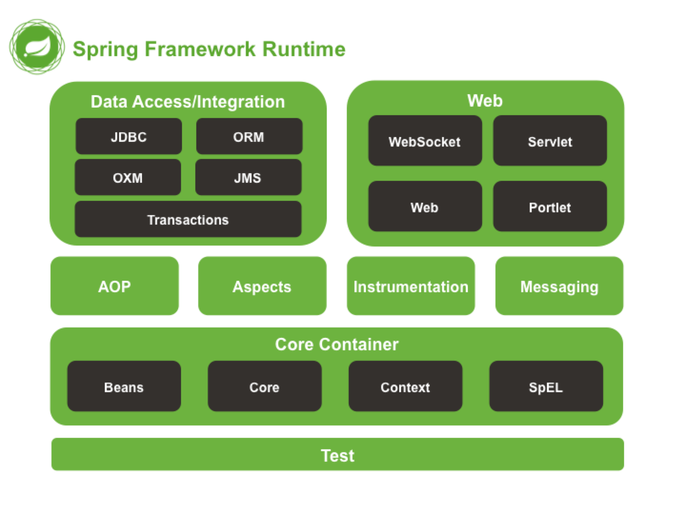

= Gen-C Spring 2
:toc: right
:toclevels:5
:sectnums:

== Why Spring Framework

*Why is Spring Framework So Popular?*

* *Simplifies Java development* – Spring makes it easier to build enterprise-level applications by reducing boilerplate code.
* *Supports Dependency Injection (DI)* – You don’t have to manually create and manage objects; Spring handles that for you.
* *Modular and Flexible* – You can use only the parts you need (like Spring MVC, Spring Boot, etc.).
* *Helps Build Web & Enterprise Apps* – Spring provides built-in support for building both web applications and backend services.
* *Works with Other Tools Easily* – Spring integrates well with popular technologies like Hibernate, JPA, JDBC, and more.
* *Spring Boot Speeds Up Development* – Spring Boot lets you create applications quickly with minimal configuration.
* *Active Community and Ecosystem* – There's a large, helpful community and tons of learning resources.
* *Production-Ready Features* – Spring offers built-in support for monitoring, security, configuration, and error handling.
* *Supports Microservices Architecture* – Spring Cloud makes it easy to build distributed, cloud-native applications.

##############################################

== Spring Modules

---

*Spring Framework Modules*

* *Spring Core*: Provides the fundamental IoC and Dependency Injection features.
* *Spring Context*: Offers application context for managing beans and configurations.
* *Spring AOP*: Supports aspect-oriented programming such as logging, transactions, and security.
* *Spring ORM*: Integrates Spring with ORM frameworks like Hibernate and JPA.
* *Spring JDBC*: Simplifies database access and error handling in JDBC.
* *Spring MVC*: Enables building web applications using the Model-View-Controller pattern.
* *Spring Security*: Provides authentication, authorization, and protection against common security threats.
* *Spring Web*: Contains foundational web support including multipart file upload and initialization.
* *Spring Web Flow*: Manages complex user flows in web applications.
* *Spring Test*: Supports testing of Spring components using JUnit or TestNG.
Here’s an updated version including those additional Spring modules, all explained in **1–2 lines each** in AsciiDoc format:
* *Spring OXM*: Supports Object/XML Mapping using frameworks like JAXB and Castor.
* *Spring JMS*: Provides features to produce and consume messages using Java Messaging Service (JMS).
* *Spring Servlet*: Part of Spring Web, it integrates with the servlet API and manages request-response workflows.
* *Spring Aspects*: Provides integration with AspectJ for aspect-oriented programming (AOP) capabilities.
* *Spring Instrumentation*: Supports class instrumentation and classloader transformations for certain application servers.
* *Spring Messaging*: Provides messaging support for STOMP, WebSockets, and integration with message brokers like RabbitMQ.
* *Spring Transaction*: Provides a consistent programming model for transaction management across different transaction APIs (JDBC, JPA, Hibernate), with support for declarative and programmatic transactions.

##############################################

== Spring Projects

*Spring Ecosystem Projects - One-liner Descriptions*

* *Spring Boot*: Simplifies Spring application development with auto-configuration and embedded servers.
* *Spring Cloud*: Provides tools for building distributed systems including configuration, service discovery, and circuit breakers.
* *Spring Data*: Simplifies data access by reducing boilerplate code for data repositories and supports multiple data stores (JPA, MongoDB, etc.).
* *Spring Security*: Handles authentication, authorization, and protection against common security vulnerabilities.
* *Spring Batch*: Supports large-scale, batch processing of data with transaction management and job scheduling.
* *Spring Integration*: Enables integration with external systems using messaging channels and adapters.
* *Spring HATEOAS*: Helps create RESTful APIs that follow HATEOAS (Hypermedia as the Engine of Application State) principles.
* *Spring Session*: Manages user sessions and supports multiple backends like Redis and JDBC.
* *Spring AMQP*: Provides support for messaging using AMQP (e.g., with RabbitMQ).
* *Spring Web Services*: Facilitates creating document-driven, contract-first SOAP web services.
* *Spring GraphQL*: Enables GraphQL APIs in Spring applications with support for reactive and annotated controllers.

##############################################

##############################################

##############################################

##############################################

##############################################

##############################################

##############################################

##############################################

##############################################

##############################################

##############################################

##############################################

##############################################

