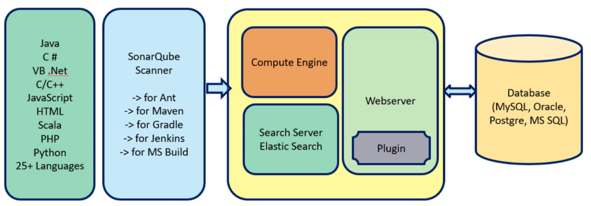

= SonarQube
:toc: right
:toclevels:5
:sectnums:


== What is SonarQube?

*SonarQube* is an open-source platform used for continuous inspection of code quality. It detects issues such as:

* Bugs
* Code Smells

*Code Smells* are *symptoms of poor design or bad coding practices* that may not break your application, but can make it harder to understand, maintain, or extend in the future.

Think of them as *"warning signs"* in your code.

---

```java
public void process() {
    if (status == 1) {
        // do something
    } else if (status == 2) {
        // do something else
    } else if (status == 3) {
        // yet another thing
    }
}
```

*Why it's a code smell:*
This method has *too many if-else conditions* — it's hard to read and maintain.

*Better approach:*
Use `enum`, `switch-case`, or refactor into smaller methods.


* Security Vulnerabilities
* Duplications
* Coverage (from unit tests)

It supports many programming languages including Java, C#, JavaScript, Python, etc.

*Why Use SonarQube?*

* Improves code quality by enforcing coding standards.
* Helps detect bugs early in development.
* Tracks technical debt.
* Supports DevOps by integrating into CI/CD pipelines.


== Basic Workflow

1. Developer writes code.
2. Code is pushed to repository.
3. SonarQube analyzes the code (either locally or via CI/CD).
4. Issues are reported on the dashboard.
5. Developer fixes issues if quality gate fails.


##############################################


== Seven(7) Axes of Code Quality in Java

*1. Reliability (Bugs)*

*Description:*
Ensures that the Java code works correctly without unexpected crashes or incorrect results.

*Example (bad):*
[source,java]
----
String name = null;
System.out.println(name.length()); // NullPointerException
----

*Fix:*
[source,java]
----
if (name != null) {
    System.out.println(name.length());
}
----

*2. Security (Vulnerabilities)*

*Description:*
Prevents code from being exploited by attackers or malicious users.

*Example (bad):*
[source,java]
----
String query = "SELECT * FROM users WHERE name = '" + userInput + "'";
Statement stmt = connection.createStatement();
ResultSet rs = stmt.executeQuery(query); // SQL Injection risk
----

*Fix (use PreparedStatement):*
[source,java]
----
PreparedStatement stmt = connection.prepareStatement("SELECT * FROM users WHERE name = ?");
stmt.setString(1, userInput);
ResultSet rs = stmt.executeQuery();
----

*3. Security Hotspots*

*Description:*
Marks code that could be dangerous and needs manual review.

*Example:*
[source,java]
----
Runtime.getRuntime().exec("rm -rf /"); // Needs careful review
----

*Note:* Not always a vulnerability, but might be if misused.

*4. Maintainability (Code Smells)*

*Description:*
Improves readability and ease of maintenance.

*Example (bad):*
[source,java]
----
public void process(int type) {
    if (type == 1) {
        // do A
    } else if (type == 2) {
        // do B
    } else if (type == 3) {
        // do C
    }
}
----

*Fix (use enum + switch):*
[source,java]
----
enum TaskType { A, B, C }

public void process(TaskType type) {
    switch (type) {
        case A: // do A; break;
        case B: // do B; break;
        case C: // do C; break;
    }
}
----

*5. Coverage (Unit Tests)*

*Description:*
Percentage of code covered by automated unit tests.

*Example (test for a method):*
[source,java]
----
public int add(int a, int b) {
    return a + b;
}
----

*Test:*
[source,java]
----
@Test
public void testAdd() {
    assertEquals(5, calculator.add(2, 3));
}
----

*Goal:* Higher coverage = better tested code.

*6. Duplications*

*Description:*
Avoid repeated code to reduce maintenance effort.

*Example (bad):*
[source,java]
----
public void printHeader() {
    System.out.println("Title");
    System.out.println("------");
}

public void printFooter() {
    System.out.println("Title");
    System.out.println("------");
}
----

*Fix:*
[source,java]
----
public void printLine(String line) {
    System.out.println(line);
    System.out.println("------");
}
----

*7. Size / Complexity*

*Description:*
Smaller, focused methods and classes are easier to understand and maintain.

*Example (bad - long method):*
[source,java]
----
public void generateReport() {
    // 200+ lines of code
}
----

*Fix:*
Break the method into smaller, reusable helper methods.

[source,java]
----
public void generateReport() {
    prepareData();
    formatData();
    exportToPDF();
}
----

##############################################

== SonarQube Architecture



Sure! Here's a brief explanation of the three key components of *SonarQube’s architecture* — the *Compute Engine*, *Elasticsearch*, and the *Web Server* — and how they work together.

---

*🔧 1. SonarQube Compute Engine*

* *Purpose*: Processes and analyzes code after it's been submitted by the scanner.
* *Function*: Takes raw analysis reports from tools like SonarScanner and turns them into issues, metrics, and quality gate evaluations.
* *Timing*: Runs asynchronously after each code analysis submission.
* *Example*: When you run `mvn sonar:sonar`, the scanner sends data to SonarQube, and the Compute Engine processes it in the background.

---

*🔍 2. Elasticsearch (in SonarQube)*

* *Purpose*: Indexes and searches analysis data quickly.
* *Function*: Powers search features like finding code issues, navigating through components, and generating dashboards.
* *Note*: SonarQube uses a bundled Elasticsearch instance — you don’t need to install it separately.
* *Important*: Needs sufficient memory to work efficiently; you may see errors if heap size is too small.

---

*🌐 3. Web Server*

* *Purpose*: The user-facing component of SonarQube.
* *Function*: Hosts the web interface at `http://localhost:9000` (by default).
* *Use*: Lets users view project dashboards, code quality reports, configure quality profiles/gates, manage users, and generate tokens.

---

*🔁 How They Work Together*

1. You analyze code using SonarScanner →
2. The analysis is sent to the *Web Server* →
3. The *Compute Engine* picks it up and processes it →
4. Data is stored, indexed via *Elasticsearch* →
5. The *Web Server* shows results via the UI.

---

Would you like a simple diagram showing this flow?

##############################################

== Setting up SonarQube

*Introduction*
SonarQube is an open-source platform used to continuously inspect code quality. It performs static analysis to find bugs, code smells, and security vulnerabilities.

---

*Prerequisites*

* Java 17 or higher (OpenJDK or Oracle)
* At least 2 GB RAM
* PostgreSQL (or another supported database for production use)
* SonarQube ZIP distribution
* (Optional) Docker for containerized setup

---

*Option 1: Setup using ZIP distribution*

*Download SonarQube*

* Visit: https://www.sonarsource.com/products/sonarqube/downloads/
* Download the Community edition or another edition as needed
* Extract the ZIP file
* Example commands:

```
unzip sonarqube-<version>.zip
cd sonarqube-<version>
```

*Set Environment Variables*

```
export JAVA_HOME=/path/to/java17
export PATH=$PATH:/path/to/sonarqube/bin
```

*Start SonarQube*

Navigate to the appropriate `bin/<OS>` directory and start the service:

```
cd bin/linux-x86-64
./sonar.sh start
```

*Access SonarQube Dashboard*

Open your browser and visit:
http://localhost:9000

Default credentials:

* Username: admin
* Password: admin (you'll be asked to change it)

---

*Access Dashboard*

Open your browser and visit: http://localhost:9000


----
mvn clean verify sonar:sonar \
  -Dsonar.projectKey=SonarQube \
  -Dsonar.host.url=http://localhost:9000 \
  -Dsonar.login=sqa_042aafd30e4fe28986c99f7d9b0be5277ecb8649
----

