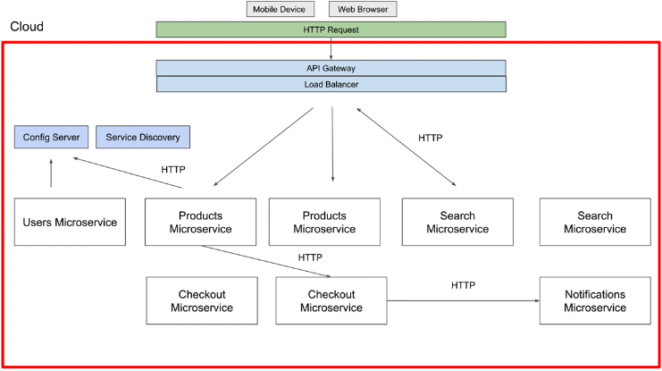
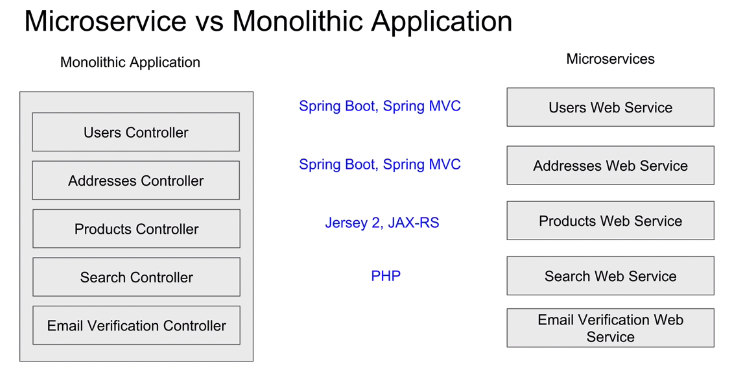
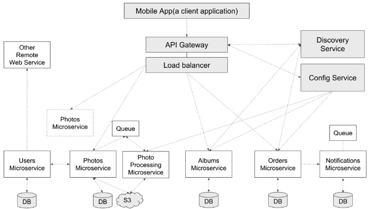

= Microservices
:toc: right
:toclevels: 5
:sectnums: 5

== Microservices

---

---

---

Microservices are a software development technique and a variant of the *service-oriented architecture*.
They structure an application as a collection of *loosely coupled, fine-grained, independently deployable services*.

=== Benefits

* Improves *modularity*, making the application easier to understand, develop, test, and scale.
* Helps *prevent architecture erosion* and increases system resilience.
* Enables *parallel development* through small autonomous teams working on different services independently.

=== Microservice Characteristics

* Each microservice is a *small web service* responsible for a *single business capability*.
** Example: One service for *search*, another for *email verification*, and another for *password reset*.
* Designed to run in the *cloud* and scale easily.

=== Spring Boot and Microservices

* Spring Boot makes it easy to build individual microservices.
* Managing many microservices requires a supporting ecosystem — Spring provides this via *Spring Cloud*.
** Spring Cloud helps with *service discovery*, *central configuration*, *monitoring*, etc.

=== Monolith vs Microservices

[cols="1,1", options="header"]
|===
| Monolithic Architecture
| Microservice Architecture

| Single Spring Boot app with multiple controllers.
| Multiple small, independent services.

| Any change requires redeployment of the *entire* application.
| Each service has its own responsibility and can be developed, deployed, and scaled independently.

| All controllers in a single app.
| Services can be written in *different languages* and run on *different platforms*.
|===

=== Microservices Communication

* Since microservices are independent, they *communicate over HTTP*.
* In monoliths, you can directly import classes; this isn’t possible in microservices.

Spring Cloud OpenFeign is a declarative REST client that simplifies HTTP communication between microservices by eliminating boilerplate code.

== Comparison: Feign Client vs WebClient vs RestTemplate

[cols="1,2,2,2", options="header"]
|===
|Feature | Feign Client | WebClient | RestTemplate

| *Introduction* | Declarative HTTP client from Spring Cloud | Reactive, non-blocking client from Spring 5 | Traditional synchronous HTTP client
| *Style* | Declarative (interface-based) | Functional, fluent API | Imperative
| *Synchronous/Asynchronous* | Synchronous | Both synchronous and asynchronous | Synchronous
| *Blocking* | Yes | No (non-blocking) | Yes
| *Reactive Support* | No | Yes (reactive streams) | No
| *Ease of Use* | Easiest (less boilerplate) | Moderate | Easy but verbose
| *Best For* | Microservices communication using interfaces | High-performance async HTTP calls | Simple REST calls
| *Customization* | Requires configuration (e.g., interceptors) | Highly configurable | Moderate customization
| *Supported in Spring Boot* | Via Spring Cloud OpenFeign | Native in Spring 5+ | Deprecated in Spring 5+
| *Thread Usage* | High (due to blocking) | Low (event loop-based) | High
| *Example Use Case* | Inter-service calls in microservice architectures | Streaming data, high load systems | Simple REST APIs or POCs
|===

==== WebClient

==== REST Template

==== Feign Client

Declarative REST client using annotated interfaces

Integrates with Spring Boot and Eureka

Supports load balancing (with Ribbon or Spring Cloud LoadBalancer)

Supports request/response interceptors, fallback mechanisms, and custom configurations

*How It Works*

You define a Java interface and annotate it with @FeignClient. Spring will automatically create a proxy for this interface and handle HTTP requests to the target service.

##############################################

=== Real-World Setup Example

* Clients (mobile/web apps) send *HTTP requests* to microservices.
* Common supporting components in a Spring Cloud ecosystem:
** *API Gateway* (entry point for all requests)
** *Load Balancer*
** *Config Server*
** *Service Discovery*
* Example microservices:
** User Microservice
** Product Microservice
** Checkout Microservice
** Notification Microservice

=== Communication Flow Example

* A Checkout service needs to send a notification → it sends an HTTP POST to the Notification Microservice.

=== Final Summary

* Microservices = small, independently deployable RESTful services.
* Built following a distinct architectural style.
* You can update one service without affecting others.
* Each service can use its own tech stack and infrastructure.

##############################################

== Mono To Micro

[cols="h,1,1,1,1,1,4", options="header"]
|===
|MS |Spring-Boot |Java |Port |RESTing|Spring-Cloud|Eureka

| University Monolith
| 2.6.6
| 17
| 8080
|-
|
a|
- http://localhost:8080/api/student/hello
- http://localhost:8080/swagger-ui/index.html

| Address
| 2.6.6
| 17
| 8082
|
|
a|
- http://localhost:8082/swagger-ui/index.html

| Student
| 2.6.6
| 17
| 8080
|
|
a|
- http://localhost:8080/swagger-ui/index.html
- Student Calls Address using WebClient

| Student Feign
| 2.6.6
| 17
|
|
| 2021.0.3
a|
- #First Start Address#
- http

|===

---

=== University Monolith

* POST

http://localhost:8080/api/student/create

----

{
"firstName": "Alice",
"lastName": "Johnson",
"email": "alice.johnson@example.com",
"street": "123 Maple Street",
"city": "Springfield"
}

{
"firstName": "Bob",
"lastName": "Smith",
"email": "bob.smith@example.com",
"street": "456 Oak Avenue",
"city": "Riverside"
}

----

* GET

http://localhost:8080/api/student/getById/2

##############################################

=== Address Microservice

* http://localhost:8082/swagger-ui/index.html

----
@RestController
@RequestMapping("/api/address")
public class AddressController {

	@Autowired
	AddressService addressService;

	@PostMapping("/create"){}

	@GetMapping("/getById/{id}"){}

	@GetMapping("/getAll"){}

}
----

##############################################

=== Student Microservice

* http://localhost:8080/swagger-ui/index.html

----
@RestController
@RequestMapping("/api/student")
public class StudentController {

	@Autowired
	StudentService studentService;

	@PostMapping("/create")
	public StudentResponse createStudent (@RequestBody CreateStudentRequest createStudentRequest) {}

	@GetMapping("getById/{id}")
	public StudentResponse getById (@PathVariable long id) {}

}

############## Student Calling Address ##############

public AddressResponse getAddressById (long addressId) {
		Mono<AddressResponse> addressResponse =
				webClient.get().uri("/getById/" + addressId)
		.retrieve().bodyToMono(AddressResponse.class);

		return addressResponse.block();
}

----

##############################################

== MS Configuration Details

* First start the *Eureka Discover Service*.

[cols="h,1,1,1,1,1,4", options="header"]
|===
|MS |Spring-Boot |Java |Port |RESTing|Spring-Cloud|Eureka

|api-gateway
|2.6.6
|17
|8020
|-
|2021.0.3
a|
- http://localhost:8020/hello

|user-microservice
|2.6.6
|17
|0
|Column 5, row 2
|2021.0.3
a|
- *Direct*: http://192.168.1.44:51293/api/users/hello
- *Gateway*: http://192.168.1.44:8020/user-service/api/users/hello

|eureka-discovery-service
|2.6.6
|17
|8010
|Server
|2021.0.3
a|
- http://localhost:8010/
- http://localhost:8080/swagger-ui/index.html

|
|
|
|
|
|
|
|===

